<picture>
  <source media="(prefers-color-scheme: dark)" srcset="assets/banner-dark.svg">
  <source media="(prefers-color-scheme: light)" srcset="assets/banner-light.svg">
  
</picture>

  Protocols, proxies, agents and the tooling that grows around them.

 

## // focus

- **Agent tooling** — plugin layers, hooks and harnesses that make coding agents hold up in a real workflow instead of a demo.
- **Local-first desktop apps** — Rust with Tauri and egui. Double-click and it runs; nothing to install first.
- **Network & proxies** — protocols, routing, traffic shaping, and the packet-level debugging that comes with them.
- **Automation & data** — browsers driven end to end, pipelines built to survive being left alone.
- **Security research** — reverse engineering, protocol analysis, and tooling written from both sides of the line.
- **Full-stack web** — when a project needs a face on it.

 

## // stack

<picture>
  <source media="(prefers-color-scheme: dark)" srcset="assets/stack-dark.svg">
  <source media="(prefers-color-scheme: light)" srcset="assets/stack-light.svg">
  
</picture>

 

## // activity

<picture>
  <source media="(prefers-color-scheme: dark)" srcset="assets/activity-dark.svg">
  <source media="(prefers-color-scheme: light)" srcset="assets/activity-light.svg">
  
</picture>

  Every graphic on this page is an SVG generated inside the profile repo by a scheduled Action — no third-party stat cards.

