<picture>
  <source media="(prefers-color-scheme: dark)" srcset="assets/banner-dark.svg">
  <source media="(prefers-color-scheme: light)" srcset="assets/banner-light.svg">
  
</picture>

  把 AI Agent 从 demo 塞进真实工作流 —— 插件层、桌面壳，以及替它们干活的那层自动化。

 

## What I'm building

- **Agent tooling** —— 给 Claude Code / Codex / dsh 写插件与挂载层，让模型能看图、能读屏、能在后台安静跑着。
- **Desktop shells** —— Rust + Tauri / egui 的本地优先桌面端。双击即用，不要求用户先自备一套运行时。
- **Automation** —— 浏览器自动化那一侧，连同配套的数据隔离与离线演练环境。

 

## Selected work

| 项目 | 一句话 | 栈 |
| :--- | :--- | :--- |
| [**dsh-desktop**](https://github.com/Jedeiah/dsh-desktop) ★2 | DeepSeek Harness 的桌面瘦壳：不内置 dsh、首次运行自动装好，带版本管理与回滚 | `Rust` `Tauri` |
| [**agent-critter**](https://github.com/Jedeiah/agent-critter) ★3 | Claude Code 桌面宠物插件，实时联动 AI 工作状态，兼容 Petdex 精灵库 | `Rust` |
| [**codex-read-image**](https://github.com/Jedeiah/codex-read-image) ★3 | 让 Codex 借纯视觉模型看图：图片转 base64 调视觉 API，结果回灌主模型 | `Python` |
| [**dsh-plugins**](https://github.com/Jedeiah/dsh-plugins) | dsh 插件集：回合提醒 / 抓取兼容 fake-ip 代理 / Chrome DevTools MCP | `JavaScript` |
| [**audio-hud**](https://github.com/Jedeiah/audio-hud) | 外呼坐席的实时电平条与状态灯，按音频会话自动跟随在用设备 | `Rust` `WASAPI` |
| [**navicat_premium_sinicization**](https://github.com/Jedeiah/navicat_premium_sinicization) ★20 | Navicat Premium 16 汉化包 | `Resource` |

 

## Stack

  

 

## Activity

<picture>
  <source media="(prefers-color-scheme: dark)" srcset="assets/overview-dark.svg">
  <source media="(prefers-color-scheme: light)" srcset="assets/overview-light.svg">
  
</picture>

  上面两张图都是本仓库里本地生成的 SVG，由 GitHub Action 每天重绘一次 —— 不挂任何第三方统计卡服务。

